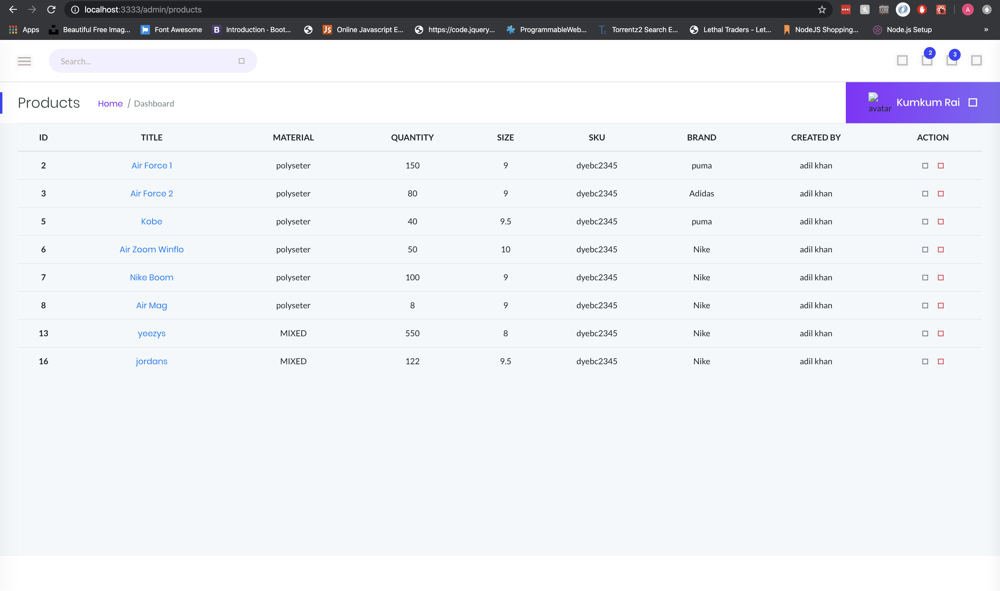
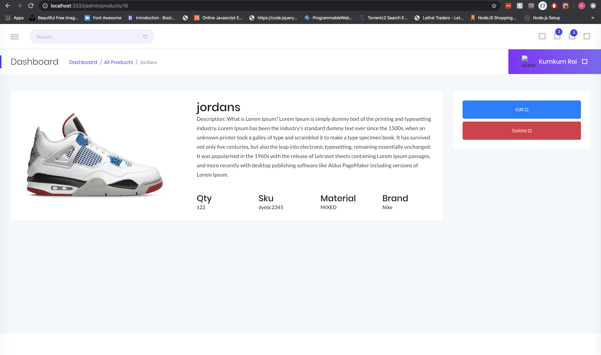

# Inventory-Management-System
_Inventory managment system it's designed to track sales of a sneaker shop can bemodified to track any type of saales_
_It has a products,brands,order and user's page_
_All the data table are done in mysql and are in the database folder_

